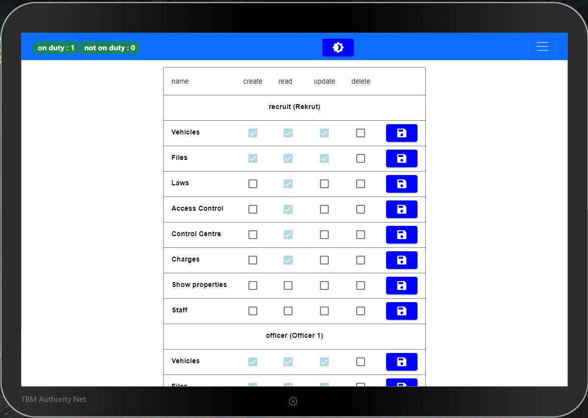
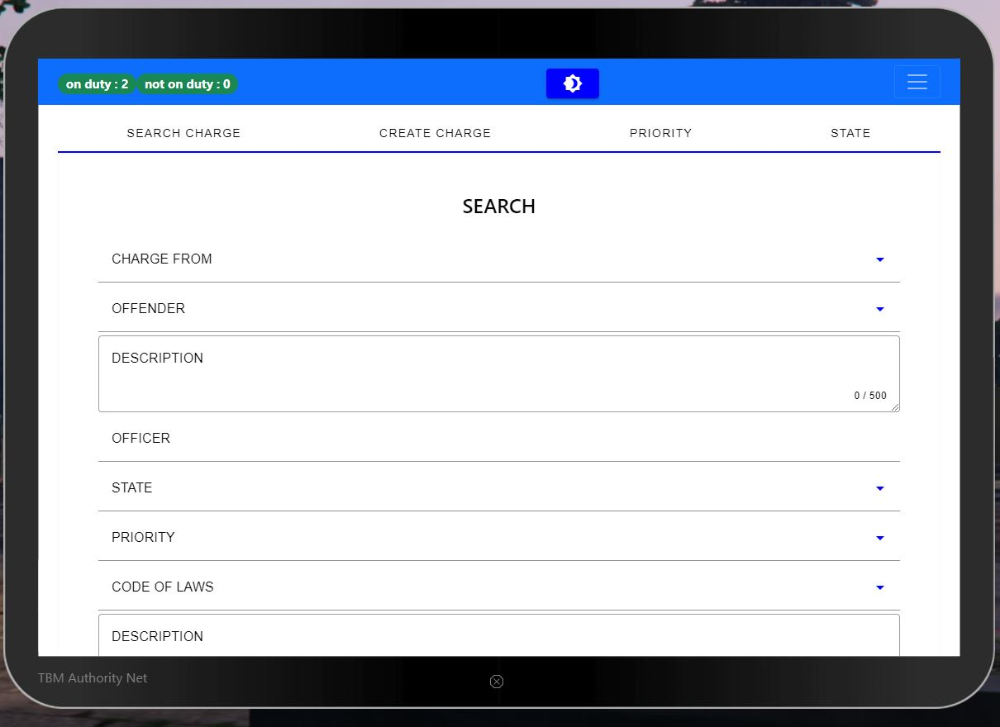
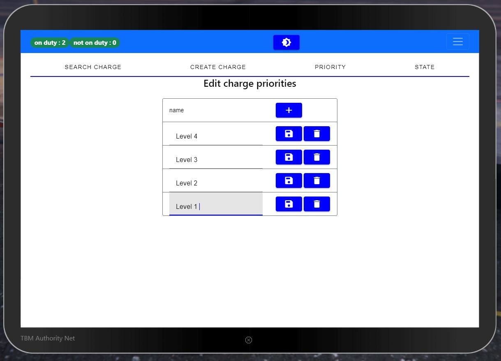
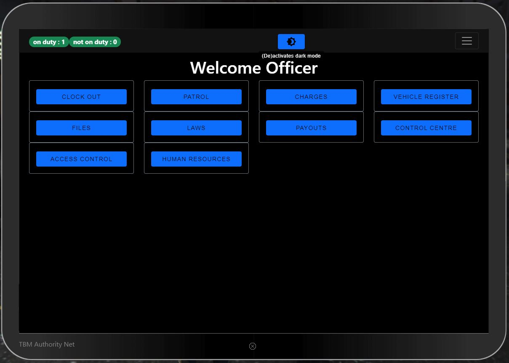
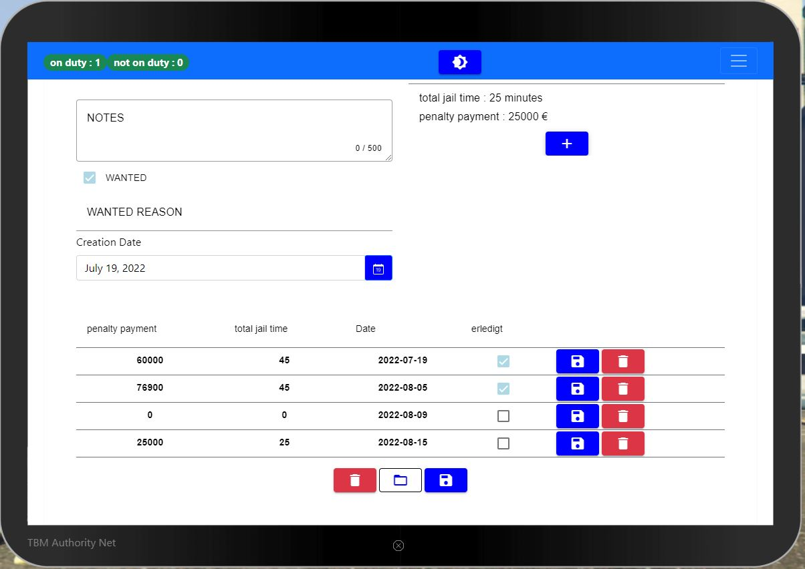
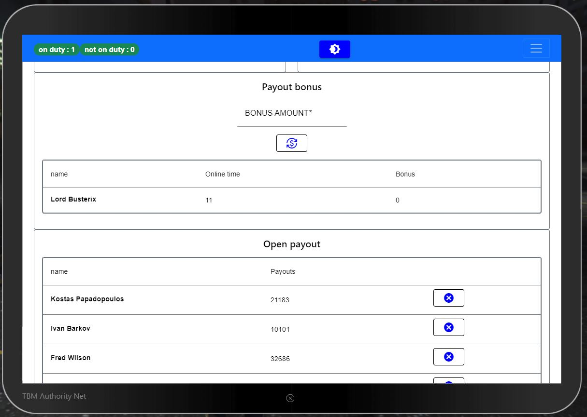

# TBM Authority Net (Police)

A tool for the management of everyday police work.

See gallery for details

# Features

- works on ESX and QB-Core
- Access Control
    - Boss can manage access to all features/grades
    - Grades can only access configured features
    - Boss has always full access
- Charges Management
- Control Center
  - Control Center Agent can see position of an officer on map
  - Control Center Agent can remove officer from Patrol
  - Control Center Agent can manage patrols/vehicle/states of patrol
  - Patrol cleans (state/vehicle) automatically if no officer is related to a patrol
- Patrols
  - Officers can join patrols 
  - Officer can change patrol state and vehicle
- Files
  - Citizen Files can be created/searched by every value/deleted/edit
  - player name can be import when cop creates a new file
  - jail time/penalty calculator based on configured laws 
- Human Resource
  - hire function
  - fire function
  - promotion management
- Laws/Law Books
  - Law management
  - Laws Book management
- Bonus payout management
  - automatically count of online time
  - bonus payout based on online time and boss control
- vehicle register
  - easy vehicle registration. if the owner is in near of vehicle, vehicle data can be imported
  - different vehicle properties can be stored 
- Police can toggle duty on/off
- Dark and Light mode


## Requirements
- ESX or QBCore


## Installation

- move mod into resource folder
- configure your config.lua
- import import.sql
- Add this line in your `server.cfg`:
```
start tbm_authority_net
```

## Gallery

### Access Control



### Charge

















## Legal
### License
You are not allowed to use this mod without a licence. You are not allowed to share the code or republish it in any way. 

